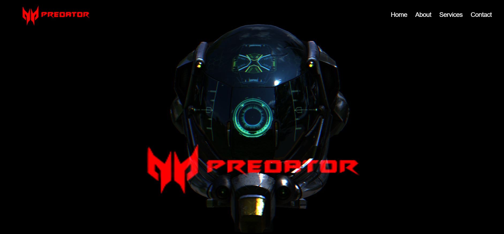

## 🚀 Landing Page

A high-performance, immersive landing page experience built with **Three.js**, **GSAP**, **TailwindCSS**, and advanced WebGL rendering techniques. This project creates a futuristic branding experience for "PREDATOR" using real-time 3D graphics, shaders, HDR environments, and animation sequences.



---

## 🌌 Features

- 🕹️ **Three.js** for real-time 3D rendering
- 🎨 **Custom GLSL Shaders** for unique visual effects
- 🌍 **HDRI Environment Mapping** for realistic lighting
- 🌀 **OrbitControls** for intuitive camera control
- 🧠 **EffectComposer/Postprocessing** for cinematic depth (bloom, DOF, etc.)
- 🔧 **GSAP Animations** for smooth page transitions and object movements
- ⚡ **TailwindCSS** for fast, utility-first UI styling
- 💡 **Responsive and Optimized** for desktop and high-performance setups

---

## 🛠️ Tech Stack

| Tech            | Purpose                                   |
|-----------------|-------------------------------------------|
| `Three.js`      | 3D scene, models, and rendering            |
| `GSAP`          | Smooth animations and scroll transitions   |
| `TailwindCSS`   | Modern responsive layout and styling       |
| `OrbitControls` | Camera interaction                        |
| `GLSL`          | Custom shaders for visuals                |
| `EffectComposer`| Post-processing pipeline (bloom, DOF, etc.)|
| `HDRI`          | Environment lighting and reflections      |

---

## 📂 Project Structure

```

📁/
├── index.html
├── src/style.css 
├── main.js                 
├── assets/
│   ├── models/textures              # 3D assets (e.g., helmet.glb           
│   ├── logo.png
│   └── screenshot.png

````

---

## 🚀 Getting Started

1. **Clone the repo**  
   ```bash
   git clone https://github.com/ShamirAli55/predator-landing-page.git
   cd predator-landing-page
````

2. **Install dependencies (if applicable)**

   ```bash
   npm install
   ```

3. **Start the local server**

   ```bash
   npm run dev
   ```

4. **Open in browser**
   Navigate to `http://localhost:3000` (or your dev server)

---


## 🧠 Notes

* Works best on modern browsers with WebGL2 support.
* Designed for high-res displays; performance may vary on low-end GPUs.
* Assets like HDRIs or models must be optimized for deployment (GLTF compression recommended).

---

